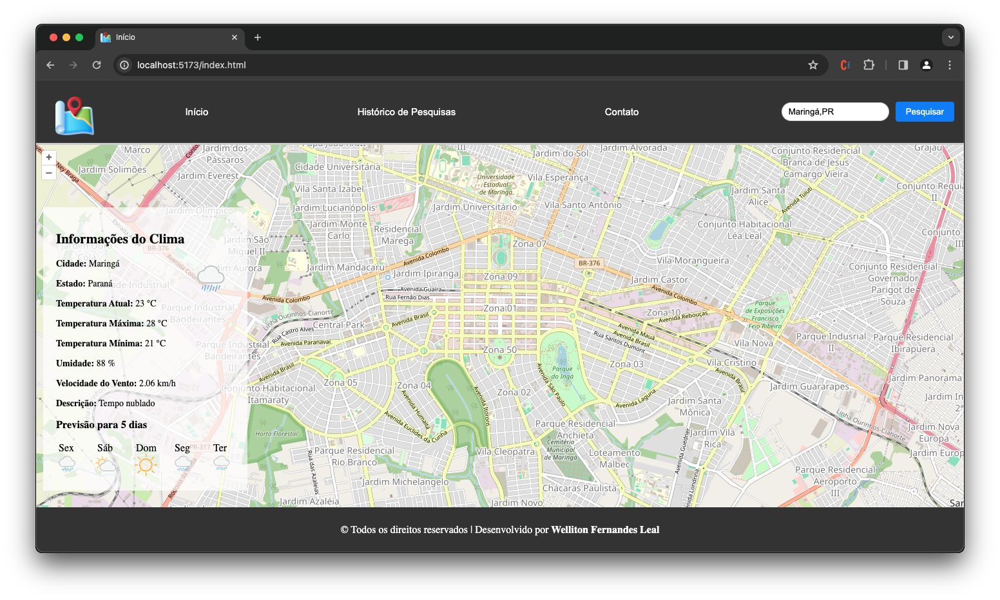

# find-on-map



O objetivo do projeto é criar uma aplicação que permita ao usuário encontrar um local no mapa e salvar o local encontrado.

# Tecnologias

Foi utilizado a biblioteca OpenLayers para a manipulação do mapa, a biblioteca Vite como servidor de desenvolvimento local e as APIs HGBrasil e Open Wheather Map para a obtenção de informações sobre o local pesquisado.

# Bibliotecas
Foi utilizada a seguinte biblioteca para a renderização e manipulação do mapa:
- [OpenLayers](https://openlayers.org/)

# APIs
Foram utilizadas duas APIs para a obtenção de informações sobre o local pesquisado:
- [HGBrasil](https://hgbrasil.com/)
- [Open Wheather Map](https://openweathermap.org/)

# Como rodar o projeto
Importante: Acesse os links das [APIs](#APIS) e crie uma conta para obter as chaves de acesso.

É necessário adicionar as chaves de acesso às APIs HGBrasil e Open Wheather Map no arquivo **.env** na raiz do projeto.

```
find-on-map/.env
```
Adicione as chaves de acesso em **VITE_API_HGBR_KEY** e **VITE_API_OPENWEATHER_KEY** respectivamente, da seguinte forma:
```
VITE_API_HGBR_KEY=chave_de_acesso
VITE_API_HGBR_URL=https://api.hgbrasil.com/
VITE_API_OPENWEATHER_KEY=chave_de_acesso
VITE_API_OPENWEATHER_URL=http://api.openweathermap.org/
VITE_PORT=3000
VITE_ZOOM_MAP_DEFAULT=14
```
Após adicionar as chaves de acesso, execute os seguintes comandos:

1) Instalar todas as dependências do projeto:
```
yarn
```
2) Rodar o projeto:
```
yarn start
```
ou
```
npm start
```
Se tudo ocorrer bem, o projeto estará rodando em http://localhost:5173.

---
[Linkedin](https://www.linkedin.com/in/wellitonfernandes/) 😊